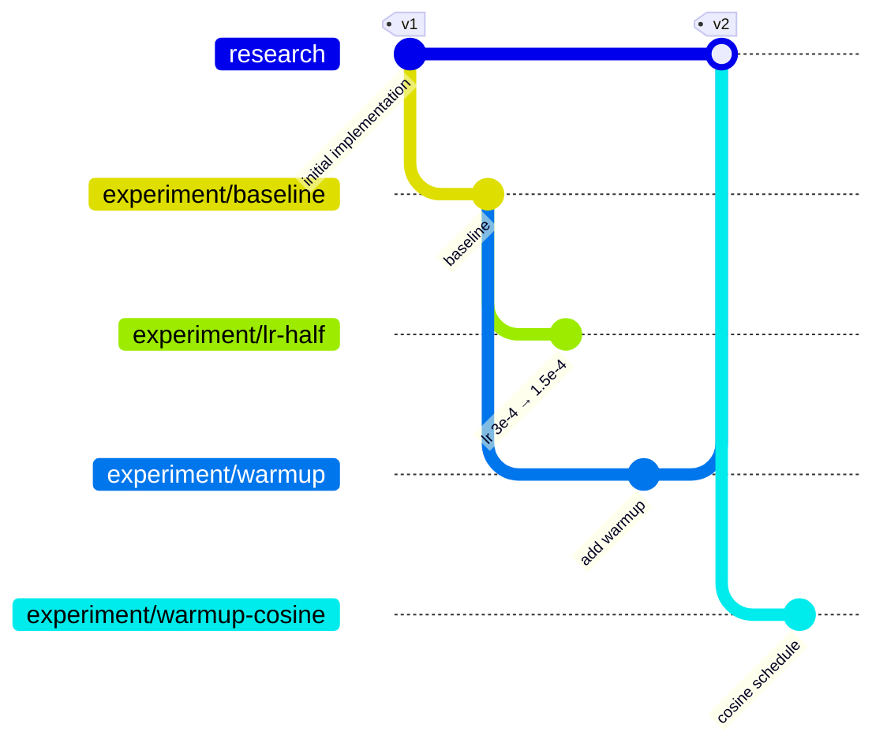

<p align="right"><b>English</b> | <a href="https://github.com/DarkPyonix/researchtree/blob/main/docs/locale/README_ko.md">한국어</a></p>

<p align="center"></p>

<h1 align="center">ResearchTree</h1>

<p align="center">
  <i>Every branch is an experiment. Every PR is its lab note.</i>
</p>

<p align="center">
  Turn your Git branches and pull requests into a living map of your research,<br>
  a tree that grows from your first implementation, one experiment at a time.
</p>

<p align="center">
  <a href="https://github.com/DarkPyonix/researchtree/blob/main/LICENSE"></a>
  
  
  
  
</p>

<p align="center">
  <a href="#-how-it-works">How it works</a> ·
  <a href="#-three-ways-to-use-it">Get started</a> ·
  <a href="#-log-from-your-training-script">Training API</a> ·
  <a href="#-open-science">Open science</a> ·
  <a href="https://darkpyonix.github.io/researchtree/guide/">Guide</a>
</p>

<p align="center">
  
</p>

> [!NOTE]
> **Available now:** the [hosted viewer](https://darkpyonix.github.io/researchtree/), the [VS Code extension](https://marketplace.visualstudio.com/items?itemName=darkpyonix.researchtree), and the [Python package](https://pypi.org/project/researchtree/) (see [Install](#-install)). An Open VSX listing is coming.
>
> **See it on a demo project:** [researchtree-demo](https://darkpyonix.github.io/researchtree/?repo=DarkPyonix/researchtree-demo), a year of made-up text-to-speech research with five versions, competing hypotheses side by side, and intent and spec documents that evolve with the evidence ([repository](https://github.com/DarkPyonix/researchtree-demo)).
>
> The viewer and the VS Code extension speak Korean and English: they follow your browser (or VS Code) language, and you can switch in **Settings**. The Python CLI output is still Korean only.

---

## 🌱 Why ResearchTree?

Research moves in small steps: you take working code, change one assumption, and see what happens.
Those attempts usually end up scattered across dashboards, notebooks, chat threads, and commit messages.
Later it is hard to tell which idea came from where, what was adopted, and why the others were dropped.

ResearchTree fixes that with a few rules you already know how to follow:

| | Rule | What it means |
|---|---|---|
| 🌿 | **One branch = one experiment** | A branch holds one small, focused change that tests one hypothesis. |
| 📓 | **One PR = one lab note** | The PR body records the hypothesis, the change, the metrics, and the conclusion. |
| 🌳 | **Branching = the tree** | Branch experiment B off experiment A, and B becomes A's child in the tree. |
| ✅ | **PR state = the verdict** | Open means running, merged means adopted, closed means rejected. |

The viewer reads those pull requests and draws them as a tree. Click any experiment to see its results.
There is no database and no server-side cache: **GitHub is the only data store.**

## 📸 Screenshots

<table>
  <tr>
    <td width="50%"></td>
    <td width="50%"></td>
  </tr>
  <tr>
    <td align="center"><b>Version panel</b>: tag date, merged experiments, metrics, and what grew from it</td>
    <td align="center"><b>Press-down morph</b>: the camera turns top-down and the islands flatten</td>
  </tr>
  <tr>
    <td width="50%"></td>
    <td width="50%"></td>
  </tr>
  <tr>
    <td align="center"><b>Flat view</b>: the same scene seen from above, with only paths, plots and stones left</td>
    <td align="center"><b>Sign-in</b>: GitHub or a personal access token</td>
  </tr>
</table>

<sub>Screenshots use sample data.</sub>

## 🧭 How it works

### Branches become a tree

`research` is the root: your initial implementation, and the line where adopted experiments are merged.
Every experiment lives on `experiment/<name>`. When adopted experiments are merged into `research`, you tag the merge with the next version, and the tree keeps growing from there.



<sub>In the tree above, <code>lr-half</code> gets closed (rejected), <code>warmup</code> is adopted and merged as <code>v2</code>, and <code>warmup-cosine</code> starts from <code>v2</code>.</sub>

| Branch | Role | Shown in the tree |
|---|---|:---:|
| `research` | Root of the tree, versioned with tags `research/v1`, `research/v2`, … (`research/v1.1` works too; prefixed with the root branch so they never clash with release tags like `v1` on `main`) | ✅ as the root and version milestones |
| `experiment/*` | One branch per experiment | ✅ as nodes |
| `main`, `develop`, everything else | Deployment, general development, unrelated work | ❌ hidden |

> [!TIP]
> The root branch name (`research`) and the experiment prefix (`experiment/`) are only defaults.
> You can change both per repository in the viewer's **branch settings**. Set `RESEARCHTREE_PREFIX` so the training-script API uses the same prefix.

### The PR body is the lab note

Put a single `yaml` block at the **top** of the PR body. The viewer reads only the first `yaml` block. Everything below it is free-form Markdown.

````markdown
```yaml
parent: experiment/baseline-moshi
hypothesis: Halving the depth-transformer LR reduces early divergence
change: lr 3e-4 → 1.5e-4
metrics:
  val_loss: 2.31
  wer: 0.184
wandb: https://wandb.ai/...
status: rejected
tags: [lr]
```

## Conclusion
Divergence went down, but convergence was too slow. Rejected.
````

| Field | | Meaning |
|---|---|---|
| `hypothesis` | required | One sentence you want to test |
| `parent` | recommended | Parent experiment branch, or `research@vN` for an experiment that starts from a research version. Falls back to the PR's base branch |
| `change` | recommended | Summary of the code or config change |
| `metrics` | optional | Final metrics (`name: number \| string`). Agree on key names within your team |
| `wandb` | optional | Link to curves or other external records |
| `status` | optional | `running` \| `adopted` \| `rejected`, to override the status derived from the PR |
| `tags` | optional | Labels such as `lr`, `data`, `arch` |

Unknown fields are kept. When ResearchTree rewrites a PR body, it changes only the YAML block and preserves comments, key order, and the Markdown below. A broken YAML block is never overwritten.

<details>
<summary><b>How status, parent, and versions are resolved</b></summary>

<br>

**Status**, first match wins:

1. `status` in the YAML
2. PR merged → `adopted`
3. PR closed without merging → `rejected`
4. Otherwise (open) → `running`. Draft PRs are drawn as sprouts.

**Parent**, first match wins:

1. `parent` in the YAML. `research@vN` attaches to that version. An unknown version shows a warning and attaches to the first version.
2. The PR's base branch. If it is `research` and version tags exist, the node attaches to the latest version tagged before the PR was opened.
3. Anything else (for example `main`): the node is marked as an **orphan** and attached under the root.

**Versions**

- An adopted experiment merged into `research` produces a version: the tag on its merge commit, or the first tag after the merge.
- A version continues from the **end of the adopted chain** that was merged: if the merged experiment had adopted children merged into it (and those had their own), the version grows from the last one, since its code holds every change down to there. When a chain has several ends, or several experiments go into one version, the latest end is the parent and every other end joins the new island with a dashed merge line.
- A version's metrics are those of the chain end it grows from. They are the Δ baseline for experiments that start from that version.

**Which PRs appear**

- Only PRs whose head is `experiment/*` become nodes.
- A PR from `experiment/*` into a non-research branch (`main`, `develop`) is hidden, unless its YAML has a `parent`.
- If a branch has several PRs, the most recent one whose base is `research` or `experiment/*` is used.

</details>

<details>
<summary><b>Starting a new version and a new experiment</b></summary>

<br>

```bash
# adopt an experiment into research and tag the next version
git switch research && git merge --no-ff experiment/depth-lr-warmup
git tag -a research/v2 -m "v2: adopt warmup" && git push origin research research/v2

# start a new experiment from that version (PR base: research, YAML: parent: research@v2)
git switch -c experiment/warmup-cosine research/v2

# or derive one from another experiment (PR base: the parent experiment)
git switch experiment/baseline-moshi
git switch -c experiment/depth-lr-half
```

Open a draft PR as soon as you start. To adopt, merge into the parent. To reject, write the conclusion and close the PR. Finished branches are cleaned up when you cut the next version:

```bash
researchtree release        # plan: delete merged branches, archive the rest, keep ones with running children
researchtree release --yes  # archive (revert the branch's commits, merge into research), tag research/vN, push, delete
```

Unmerged branches are never just deleted: their commits are reverted on the branch (a revert, not a reset) and the branch is merged into `research`, so the history stays reachable while the code is unchanged.

> [!IMPORTANT]
> Turn **off** "Automatically delete head branches" in your repository settings. If a parent branch with running children is deleted, GitHub retargets the children's PRs and the tree loses that link. Let `researchtree release` delete branches instead.

</details>

## 🏝️ The viewer

<table>
  <tr><td>🏝️ <b>Research island</b> (default)</td><td>A pastel voxel island in isometric view. <code>research</code> is the big old tree. Dirt paths tinted with each branch's color lead to garden plots where experiments grow. Research versions are stone obelisks with banners, and every version gets its own island, set apart by open water. Where a path leaves an island it ends at a wooden ferry landing, and a little moored ferry with a sail and a flag in the branch color bobs in the channel. On first open, the island grows generation by generation.</td></tr>
  <tr><td>🌿 <b>Plants show status</b></td><td><b>Adopted</b>: a grown tree with fruit and a fence · <b>Running</b>: a swaying sapling · <b>Rejected</b>: a grey stump with fallen leaves · <b>Draft</b>: a sprout</td></tr>
  <tr><td>🗺️ <b>Flat view</b></td><td>Press <b>Flat view</b> and the camera turns top-down while the plants are pressed flat. Ground, water, landings, ferries and decorations disappear, leaving the dirt paths, plots, version stones and label chips on the page; sea crossings become dashed path tiles so branches stay connected. In flat view you pan and zoom only. Press <b>3D view</b> and the islands rise back. Your selection is kept either way.</td></tr>
  <tr><td>📋 <b>Detail panel</b></td><td>Hypothesis, change, and conclusion (sanitized Markdown), metrics with <b>Δ against the parent</b> experiment or version, the commit list, child-experiment chips, and <i>Open on GitHub</i>.</td></tr>
  <tr><td>🗿 <b>Version panel</b></td><td>Tag date and commit, merged experiments, the version's metrics, experiments that start from it, and the next version.</td></tr>
  <tr><td>🎛️ <b>Navigation</b></td><td>Status layers (running / adopted / rejected), a label metric chosen per island in the version panel (each research version can show a different metric), a generation navigator, arrow-key navigation (<kbd>←</kbd> <kbd>→</kbd> parent/child, <kbd>↑</kbd> <kbd>↓</kbd> siblings, <kbd>Esc</kbd> to close), and a camera that flies to whatever you click.</td></tr>
  <tr><td>🍂 <b>Timeline &amp; seasons</b></td><td>A real time axis: nodes sit at their start date, and the year and season at the center of the screen are shown under the top-left card as you pan. Each tree keeps its branch color and shows the season of its last work with effects (spring blossoms and falling petals, summer fireflies, autumn falling leaves, winter snow caps), and the island ground changes season along the axis.</td></tr>
  <tr><td>🔗 <b>Share links</b></td><td><code>?repo=owner/name&amp;node=experiment/x</code> opens the same repository and experiment for anyone with access.</td></tr>
  <tr><td>⚠️ <b>Warnings</b></td><td>Broken YAML, missing required fields, and orphan nodes get a badge next to the node.</td></tr>
</table>

<sub>The viewer needs WebGL. Without it, the tree cannot be drawn.</sub>

## 🚀 Three ways to use it

One viewer, three hosts. Pick whichever fits your setup.

| | Hosted web | VS Code extension | Local server |
|---|---|---|---|
| **Install** | Nothing | `darkpyonix.researchtree` | `uv tool install researchtree` |
| **Open** | `https://darkpyonix.github.io/researchtree/` | `ResearchTree: Open Tree` | `researchtree serve` |
| **Sign in** | GitHub or a PAT | VS Code's built-in GitHub account | Device Flow or `RESEARCHTREE_TOKEN` |
| **Repository** | `?repo=` or the picker | Workspace `origin` remote | Current directory's remote or `--repo` |
| **Extras** | Share links | Checkout a branch, diff vs. parent | Nothing goes through a central server |
| **Status** | Live | On the VS Code Marketplace | On PyPI |

<details>
<summary><b>🌐 Hosted web</b></summary>

<br>

Open the site, sign in, pick a repository. The repository list shows repositories you can access that have a `research` branch (or your configured root branch).

To limit access to chosen repositories, open **Sign in with a personal access token (PAT)** on the sign-in screen instead. For a fine-grained token, grant the target repository **Pull requests (read/write)** and **Contents (read)**. The token is stored only in that browser.

</details>

<details>
<summary><b>🧩 VS Code extension</b></summary>

<br>

Run **`ResearchTree: Open Tree`** from the command palette. The repository comes from your workspace's git remote, and sign-in uses VS Code's GitHub account, so you only click *Allow* once. Inside VS Code you can also check out an experiment branch locally and open its diff against the parent in the diff editor.

Install it from the [VS Code Marketplace](https://marketplace.visualstudio.com/items?itemName=darkpyonix.researchtree), or run `code --install-extension darkpyonix.researchtree`.

</details>

<details>
<summary><b>💻 Local server</b></summary>

<br>

A self-hosted option. It needs no central site and no auth proxy, and your machine doesn't need Node, because the built viewer ships inside the wheel.

```bash
uv tool install researchtree
researchtree serve                  # opens http://127.0.0.1:7337 in your browser
```

| Command | What it does |
|---|---|
| `researchtree serve [--repo owner/name] [--port N] [--no-browser]` | Serve the viewer locally. Defaults to the current directory's repository |
| `researchtree login` / `logout` | Device Flow sign-in from the terminal (for headless GPU boxes) / delete the stored token |
| `researchtree open [--repo owner/name]` | Open the current repository in the hosted viewer |

On a machine without a browser, you can also pass a token through the environment:

```bash
export RESEARCHTREE_TOKEN=github_pat_...
researchtree serve
```

</details>

## 🧪 Log from your training script

Add the same package to your training project, and your training script can write straight into the current branch's PR.

```python
import researchtree as rt

rt.log(val_loss=2.31, wer=0.184)        # merge into `metrics` (None deletes a key)
rt.set(wandb=run.url)                   # set any YAML field
rt.conclude("rejected", "Converged too slowly", heading="Conclusion")  # set status + write a "## Conclusion" section
```

- **Never breaks training.** If the branch isn't an experiment branch, no PR is found, or GitHub fails, you get a warning and the script keeps running.
- **Distributed-safe.** It acts only on rank 0 (`RANK` / `LOCAL_RANK`).
- **Conclusion section.** An existing conclusion section is updated in place, whether its heading is English (`## Conclusion`) or Korean. A new one gets `heading` (the default is the Korean heading used by the original convention).
- **Lossless.** It edits only the YAML block, using the same rules and the same test fixtures as the TypeScript viewer.

| Environment variable | Purpose |
|---|---|
| `RESEARCHTREE_TOKEN` | GitHub token. Takes precedence over the token saved by `researchtree login` (OS keyring or a `0600` file) |
| `RESEARCHTREE_PREFIX` | Experiment branch prefix. Default: `experiment/` |
| `RESEARCHTREE_REPO` | `owner/name`, if it can't be inferred from the `origin` remote |

## 🧠 Research memory for agents

The same record doubles as memory for coding agents. `rt.load()` returns the whole PR tree as typed Python objects, versions (islands) → experiments → body sections → commits. An agent starts from a short manifest and drills down only where it needs to, so questions like "how many experiments were rejected per version?" become one-line computations instead of searches through notes.

```python
import researchtree as rt

research = rt.load()                          # the repo of your `origin` remote
print(research.manifest())                    # islands, best results, running work, alerts
e = research["duet-mix"]                      # .hypothesis .metrics .parent .children .conclusion
e.delta("tts_wer"), e.commits()               # vs the parent; commits are read lazily from GitHub
research.experiments.where(status="adopted").best("val_loss")
{v.name: len(v.experiments.where(status="rejected")) for v in research.versions}
research.check()                              # deterministic rules: stale runs, regressions, missing metrics
```

From a terminal: `researchtree memory`, `researchtree memory v3`, `researchtree memory duet-mix`, `--check`, `--json`.

To teach a coding agent the whole workflow (branch and PR conventions, the PR body, `rt.log`, this memory API, `researchtree release`), install the bundled skill into your repository:

```bash
researchtree skill install    # writes SKILL.md to .claude/skills/researchtree/ and/or .agents/skills/researchtree/
```

> [!NOTE]
> Inspired by [User as Code](https://arxiv.org/abs/2606.16707) (Li, 2026), which keeps agent memory as typed Python state plus executable rules. Here the pull requests are the append-only log and the YAML block is already the typed state, so no separate structuring step is needed. GitHub stays the only data store.

### Intent and spec documents

Keep **why** (`INTENT.md`: goals, claims with ids like `N1`, non-goals), **what the system is now** (`SPEC.md`: decisions only, one feature per section, each opening with a one-line `>` summary) and **evidence** (PR bodies) apart. An experiment that changes the design edits `SPEC.md` on its own branch, so each version's spec holds only adopted designs, and experiments list the claims they test with `claims: [N1]`.

```bash
researchtree spec --summary     # the latest design on one page
researchtree spec --diff        # what changed since the previous version
researchtree spec --claims      # each claim with the experiments that tested it
```

In the viewer, the version panel's **Spec** tab shows each version's spec in full, as a summary, or as changes since the previous version, with a history per section, and the experiment panel's **Spec** tab shows what that branch changed. Set other paths in `.researchtree.yml` on the root branch (`spec:`, `intent:`, `prefix:`). See the [guide](https://darkpyonix.github.io/researchtree/guide/rules/spec).

## 📦 Install

```bash
pip install researchtree            # into a training project (or: uv add researchtree)
uv tool install researchtree        # or as a standalone CLI
```

Optional: `pip install "researchtree[keyring]"` stores the token in the OS keyring instead of a file.

To install the latest development version from the repository, use `pip install git+https://github.com/DarkPyonix/researchtree`. The build hook compiles the viewer, so this needs Node and npm.

## 🔒 Security & privacy

- **Your token stays on its host.** It lives in browser `localStorage` (web), the extension host (VS Code, never the webview), or the local Python process (local). It is only ever sent to `api.github.com`, and every call goes through a path-only API check.
- **The auth proxy only exchanges codes.** The small Cloudflare Worker turns an OAuth code into a token for the hosted site. It stores and logs nothing, and it accepts only allow-listed origins.
- **The local server stays local.** It binds to `127.0.0.1`, rejects unexpected `Host` headers (DNS rebinding), requires a per-run session token, and blocks `DELETE` on its GitHub relay.
- **PR bodies are untrusted.** Markdown is sanitized with DOMPurify, and a strict CSP allows only bundled scripts. Nothing loads from a CDN at runtime.
- **No database.** Everything is read from and written to GitHub. Nothing is cached on a server.

## 🔬 Open science

Every experiment is an ordinary Git branch and every lab note is an ordinary pull request, so the full record of a research project lives in the repository itself: the exact code of each attempt, the hypothesis behind it, the metrics it produced, and why it was adopted or ruled out. Nothing sits in a private notebook or a separate database.

That makes the whole experimental history easy to publish. Make the repository public and you share more than the final result: the path that led to it, including the negative results and abandoned ideas that papers usually leave out. Anyone can check out a branch to reproduce a single experiment, compare it with its parent, or branch off from it to continue the work.

ResearchTree supports open science in this way: transparent, reproducible research whose experiment records can be shared in full.

## 🛠️ Development

<details>
<summary><b>Repository layout and commands</b></summary>

<br>

An npm-workspaces monorepo with one level of products under `apps/`. `tests/` mirrors the same names.

| Path | What |
|---|---|
| `apps/core` | TypeScript shared logic: `Host` interface, GitHub client, PR-body parser, tree builder |
| `apps/ui` | The viewer: the island view (three.js, 3D and flat), the web / local / extension hosts, and the Vite build for all three |
| `apps/extension` | VS Code extension host |
| `apps/proxy` | Cloudflare Worker for the OAuth code exchange |
| `apps/researchtree` | Python package: CLI, local server, Device Flow, `rt.log` / `set` / `conclude` |
| `tests/` | vitest and pytest suites, plus fixtures shared by the TS and Python PR-body parsers |

```bash
npm install                 # from the repo root
npm run dev                 # web dev server on :5173
npm test                    # vitest
npm run typecheck
npm run build               # web + local + extension builds
npm run package:extension   # .vsix
uv run pytest               # Python tests
uv build                    # Python wheel
```

</details>

The **[guide](https://darkpyonix.github.io/researchtree/guide/)** covers architecture and details.

## 🤝 Contributing

Issues and pull requests are welcome. A few conventions:

- Commit messages use `Type: Summary` on one line, in English and in the imperative mood, for example `Feat: Add tree view` or `Fix: Keep selection on view switch`. Types: `Feat`, `Fix`, `Refactor`, `Test`, `Docs`, `Chore`.
- PR-body rules are implemented twice, in TypeScript and Python. Change `tests/fixtures/prbody-cases.json` first, then make both implementations pass.
- Run the tests and the typecheck for every package you touch.

## 📄 License

[Apache License 2.0](https://github.com/DarkPyonix/researchtree/blob/main/LICENSE) © DarkPyonix
