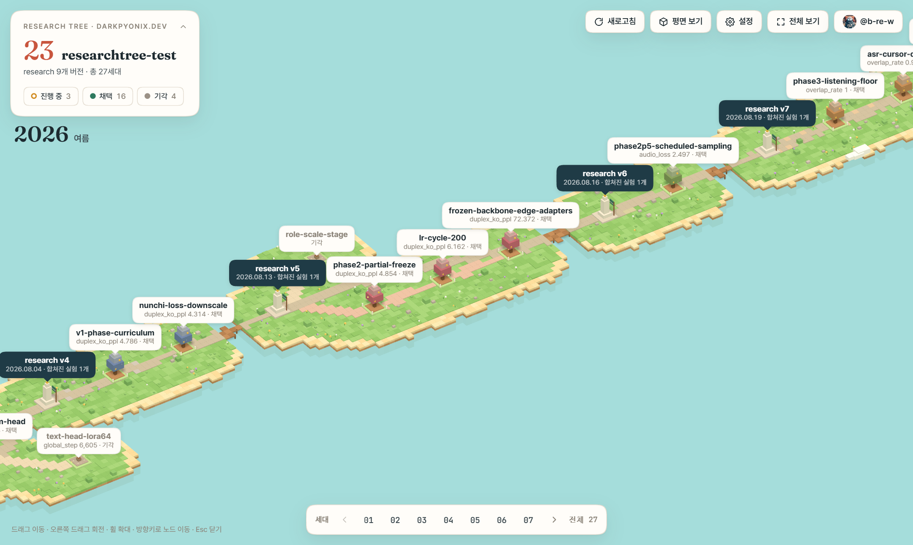
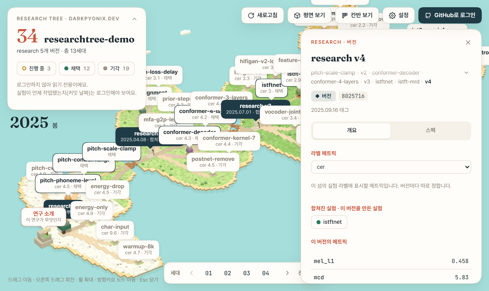
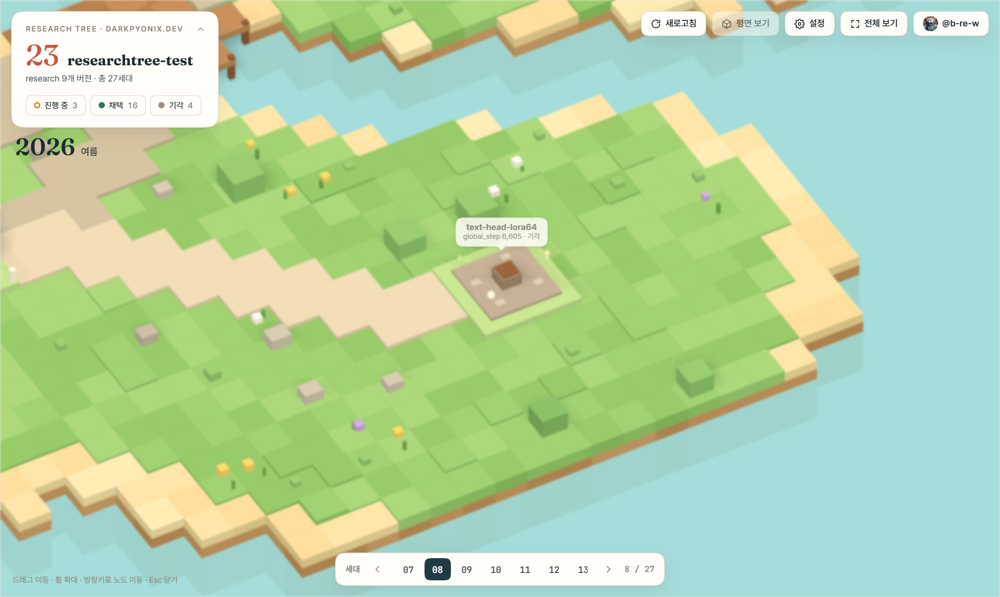
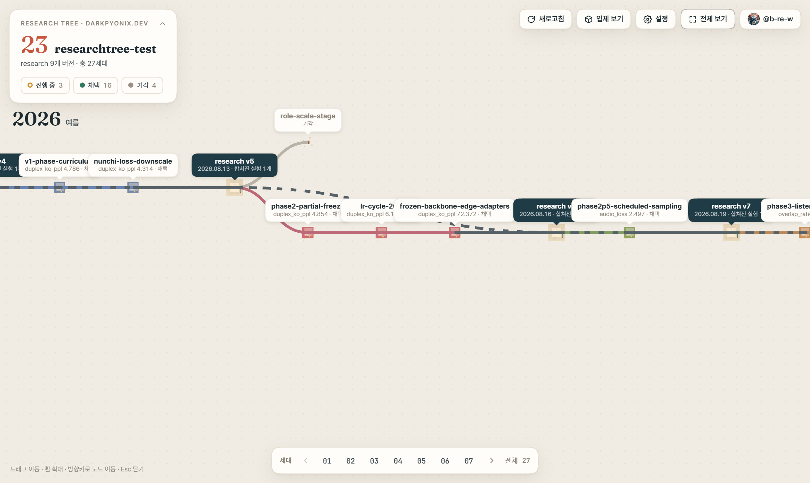
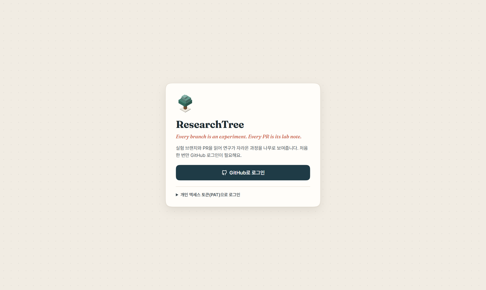
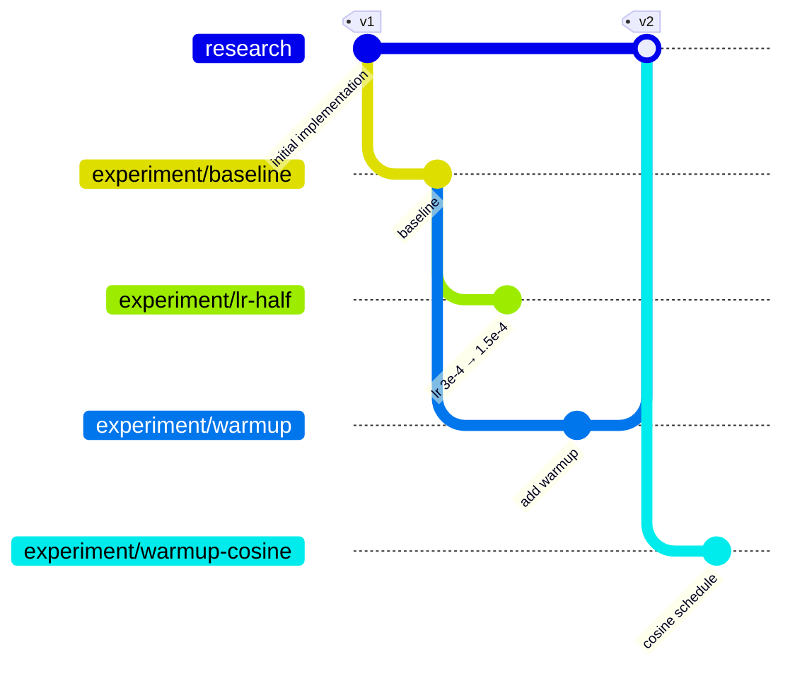

<p align="right"><a href="../../README.md">English</a> | <b>한국어</b></p>

<p align="center"></p>

<h1 align="center">ResearchTree</h1>

<p align="center">
  <i>Every branch is an experiment. Every PR is its lab note.</i><br>
  <sub>브랜치 하나는 실험 하나, PR 하나는 그 실험 일지.</sub>
</p>

<p align="center">
  Git 브랜치와 Pull Request를 연구의 지도로 바꿉니다.<br>
  초기 구현에서 시작해 실험 하나하나가 가지를 뻗는 트리로 보여 줍니다.
</p>

<p align="center">
  <a href="../../LICENSE"></a>
  
  
  
  
</p>

<p align="center">
  <a href="#-동작-방식">동작 방식</a> ·
  <a href="#-사용하는-세-가지-방법">시작하기</a> ·
  <a href="#-학습-스크립트에서-기록하기">학습 연동 API</a> ·
  <a href="#-오픈-사이언스">오픈 사이언스</a> ·
  <a href="https://darkpyonix.github.io/researchtree/guide/">가이드</a>
</p>

<p align="center">
  
</p>

> [!NOTE]
> **지금 쓸 수 있는 것:** [중앙 웹 뷰어](https://darkpyonix.github.io/researchtree/), [VS Code 확장](https://marketplace.visualstudio.com/items?itemName=darkpyonix.researchtree), [Python 패키지](https://pypi.org/project/researchtree/)([설치](#-설치) 참고). Open VSX 등록은 곧 할 예정입니다.
>
> **데모 프로젝트로 보기:** [researchtree-demo](https://darkpyonix.github.io/researchtree/?user=DarkPyonix&repo=researchtree-demo). 가상의 음성 합성(TTS) 연구 1년치로, 버전 다섯 개, 나란히 비교한 경쟁 가설들, 근거에 따라 바뀌는 의도·스펙 문서를 담았습니다([레포](https://github.com/DarkPyonix/researchtree-demo)).
>
> 뷰어와 VS Code 확장은 한국어와 영어를 지원합니다. 기본은 브라우저(또는 VS Code) 언어이고 **설정**에서 바꿀 수 있습니다. Python CLI는 시스템 언어(한국어 또는 영어)를 따르고, `RESEARCHTREE_LANG=en` 또는 `ko`로 정할 수 있습니다.

---

## 🌱 왜 ResearchTree인가

연구는 작은 걸음으로 나아갑니다. 돌아가는 코드에서 가정 하나를 바꾸고 결과를 봅니다.
이런 시도는 대개 대시보드, 노트, 메신저, 커밋 메시지에 흩어집니다.
시간이 지나면 어떤 아이디어가 어디서 나왔는지, 무엇이 채택됐는지, 나머지는 왜 버렸는지 알기 어렵습니다.

ResearchTree는 이미 익숙한 몇 가지 규칙으로 이 문제를 풉니다.

| | 규칙 | 뜻 |
|---|---|---|
| 🌿 | **브랜치 하나 = 실험 하나** | 브랜치에는 가설 하나를 검증하는 작고 명확한 변경만 담습니다. |
| 📓 | **PR 하나 = 실험 일지 하나** | PR 본문에 가설, 변경점, 메트릭, 결론을 적습니다. |
| 🌳 | **분기 관계 = 트리** | 실험 A에서 실험 B를 따면 트리에서도 B가 A의 자식이 됩니다. |
| ✅ | **PR 상태 = 결론** | open은 진행 중, merged는 채택, closed는 기각입니다. |

뷰어는 이 PR들을 읽어 트리로 그립니다. 실험을 누르면 결과를 볼 수 있습니다.
데이터베이스도 서버 캐시도 없습니다. **데이터는 GitHub에만 있습니다.**

## 📸 스크린샷

<table>
  <tr>
    <td width="50%"></td>
    <td width="50%"></td>
  </tr>
  <tr>
    <td align="center"><b>버전 패널</b>: 태그 날짜, 합쳐진 실험, 메트릭, 그 버전에서 뻗은 실험</td>
    <td align="center"><b>눌러 내리기 전환</b>: 카메라가 위에서 내려다보며 섬들이 평평해집니다</td>
  </tr>
  <tr>
    <td width="50%"></td>
    <td width="50%"></td>
  </tr>
  <tr>
    <td align="center"><b>평면 보기</b>: 같은 장면을 위에서 보고 길과 텃밭, 돌만 남깁니다</td>
    <td align="center"><b>로그인</b>: GitHub 또는 개인 액세스 토큰</td>
  </tr>
</table>

<sub>스크린샷은 샘플 데이터입니다.</sub>

## 🧭 동작 방식

### 브랜치가 트리가 된다

`research`는 루트입니다. 초기 구현이 있는 곳이자 채택된 실험이 머지되는 본선입니다.
실험은 각각 `experiment/<이름>` 브랜치에 둡니다. 채택한 실험을 `research`에 머지하면 머지 커밋에 다음 버전 태그를 붙이고, 트리는 거기서 다시 자랍니다.



<sub>위 그림에서 <code>lr-half</code>는 close(기각)되고, <code>warmup</code>은 채택되어 <code>v2</code>로 머지되며, <code>warmup-cosine</code>은 <code>v2</code>에서 시작합니다.</sub>

| 브랜치 | 역할 | 트리에 표시 |
|---|---|:---:|
| `research` | 트리의 루트. `research/v1`, `research/v2` … 태그로 버전을 매깁니다(`research/v1.1`도 가능. `main`의 `v1` 같은 릴리스 태그와 겹치지 않게 루트 브랜치 이름을 붙여요) | ✅ 루트와 버전 마일스톤 |
| `experiment/*` | 실험 하나당 브랜치 하나 | ✅ 노드 |
| `main`, `develop`, 그 밖의 모든 브랜치 | 배포, 일반 개발, 연구와 무관한 작업 | ❌ 숨김 |

> [!TIP]
> 루트 브랜치 이름(`research`)과 실험 브랜치 접두사(`experiment/`)는 기본값일 뿐입니다.
> 레포의 기본 브랜치에 `.researchtree`을 두고 `root`와 `prefix`를 적으면 뷰어와 CLI, 학습 스크립트가 모두 그 이름을 씁니다.

### PR 본문이 실험 일지다

PR 본문 **맨 위에** `yaml` 블록 하나를 둡니다. 뷰어는 첫 번째 `yaml` 블록만 읽고, 그 아래는 자유 형식 마크다운입니다.

````markdown
```yaml
parent: experiment/baseline-moshi
hypothesis: depth transformer lr을 절반으로 줄이면 초반 발산이 줄어든다
change: lr 3e-4 → 1.5e-4
metrics:
  val_loss: 2.31
  wer: 0.184
wandb: https://wandb.ai/...
status: rejected
tags: [lr]
```

## 결론
발산은 줄었지만 수렴이 느려서 기각.
````

| 필드 | | 뜻 |
|---|---|---|
| `hypothesis` | 필수 | 검증하려는 가설 한 문장 |
| `parent` | 권장 | 부모 실험 브랜치. research 버전에서 시작했다면 `research@vN`. 없으면 PR의 base 브랜치를 씁니다 |
| `change` | 권장 | 코드나 설정 변경 요약 |
| `metrics` | 선택 | 최종 메트릭(`이름: 숫자 \| 문자열`). 키 이름은 팀 안에서 통일합니다 |
| `wandb` | 선택 | 학습 곡선 등 외부 기록 링크 |
| `status` | 선택 | `running` \| `adopted` \| `rejected`. PR 상태에서 유도한 값을 덮어쓸 때만 씁니다 |
| `tags` | 선택 | `lr`, `data`, `arch` 같은 태그 |

알 수 없는 필드도 그대로 보존합니다. ResearchTree는 PR 본문을 고쳐 쓸 때 YAML 블록만 바꾸고 주석, 키 순서, 아래 마크다운을 유지합니다. 깨진 YAML 블록은 절대 덮어쓰지 않습니다.

<details>
<summary><b>상태, 부모, 버전을 정하는 규칙</b></summary>

<br>

**상태**. 먼저 맞는 규칙을 씁니다.

1. YAML의 `status`
2. PR이 merged면 `adopted`
3. 머지되지 않고 closed면 `rejected`
4. 그 밖(open)이면 `running`. Draft PR은 새싹으로 그립니다.

**부모**. 먼저 맞는 규칙을 씁니다.

1. YAML의 `parent`. `research@vN`이면 그 버전에 붙습니다. 없는 버전이면 경고를 표시하고 첫 버전에 붙입니다.
2. PR의 base 브랜치. `research`이고 버전 태그가 있으면 PR을 연 시점에 가장 최근이었던 버전에 붙습니다.
3. 그 밖(예: `main`)이면 **고아** 노드로 표시하고 루트 아래에 붙입니다.

**버전**

- `research`에 머지된 채택 실험은 버전을 만듭니다. 머지 커밋에 붙은 태그, 없으면 머지 뒤 처음 붙은 태그입니다.
- 버전은 합쳐진 실험의 **채택 줄기 끝**에서 이어집니다. 머지된 실험에 채택되어 머지된 자식이 있으면 그 자식을 따라 끝까지 내려간 곳이 출발점이에요. 줄기 끝이 여러 개이거나 여러 실험이 한 버전에 합쳐지면, 가장 나중 끝에서 이어지고 나머지 끝도 모두 점선 합류선으로 새 섬에 연결됩니다.
- 버전의 메트릭은 버전이 이어진 줄기 끝 실험의 메트릭이며, 그 버전에서 시작한 실험의 Δ 기준이 됩니다.

**표시 대상**

- head가 `experiment/*`인 PR만 노드가 됩니다.
- `experiment/*`에서 연구 외 브랜치(`main`, `develop`)로 가는 PR은 숨깁니다. 단 YAML에 `parent`가 있으면 표시합니다.
- 한 브랜치에 PR이 여러 개면 base가 `research` 또는 `experiment/*`인 가장 최근 PR을 씁니다.

</details>

<details>
<summary><b>새 버전과 새 실험 시작하기</b></summary>

<br>

```bash
# 실험을 research에 채택하고 다음 버전 태그를 붙인다
git switch research && git merge --no-ff experiment/depth-lr-warmup
git tag -a research/v2 -m "v2: warmup 채택" && git push origin research research/v2

# 그 버전에서 새 실험을 시작한다 (PR base: research, YAML: parent: research@v2)
git switch -c experiment/warmup-cosine research/v2

# 또는 다른 실험에서 파생한다 (PR base: 부모 실험)
git switch experiment/baseline-moshi
git switch -c experiment/depth-lr-half
```

실험을 시작하면 바로 Draft PR을 엽니다. 채택하면 부모로 머지하고, 기각하면 결론을 쓰고 PR을 close합니다. 끝난 브랜치는 다음 버전을 낼 때 정리해요.

```bash
researchtree release        # 계획: 머지된 브랜치는 삭제, 나머지는 보관 머지, 진행 중인 자식이 있으면 보류
researchtree release --yes  # 보관 머지(브랜치의 커밋을 revert하고 research에 머지) → research/vN 태그 → push → 삭제
```

머지되지 않은 브랜치를 그냥 지우지는 않아요. 브랜치에서 커밋을 revert한 뒤(reset이 아니라 revert) `research`에 머지하므로, 코드는 그대로이고 기록은 남아요.

> [!IMPORTANT]
> 레포 설정에서 **"Automatically delete head branches"를 끄세요.** 진행 중인 자식이 있는 부모 브랜치가 삭제되면 GitHub이 자식 PR의 base를 바꿔 버려서 트리에서 연결이 끊깁니다. 브랜치 삭제는 `researchtree release`에 맡기세요.

</details>

## 🏝️ 뷰어

<table>
  <tr><td>🏝️ <b>연구의 섬</b> (기본 화면)</td><td>등각 시점의 파스텔 복셀 섬입니다. <code>research</code>는 큰 고목이고, 가지 색이 섞인 흙길이 실험이 자라는 텃밭으로 이어집니다. research 버전은 깃발을 단 돌 기념탑이고, 버전마다 섬이 따로 있어 넓은 바다로 떨어져 있습니다. 섬을 떠나는 길은 기둥 위 나무 나루터로 끝나고, 섬 사이 물 위에는 돛과 가지 색 깃발을 단 작은 나룻배가 매여 흔들립니다. 처음 열면 섬이 세대 순서대로 자라납니다.</td></tr>
  <tr><td>🌿 <b>식물로 보는 상태</b></td><td><b>채택</b>: 열매와 울타리가 있는 다 자란 나무 · <b>진행 중</b>: 살랑이는 묘목 · <b>기각</b>: 잎이 떨어진 잿빛 그루터기 · <b>초안</b>: 새싹</td></tr>
  <tr><td>🗺️ <b>평면 보기</b></td><td><b>평면 보기</b>를 누르면 카메라가 위에서 내려다보는 시점으로 돌며 식물이 납작하게 눌립니다. 땅, 물, 나루터와 나룻배, 장식은 사라지고 흙길, 텃밭, 버전 돌, 라벨 칩만 남습니다. 바다를 건너는 길은 점선 길 타일로 그려져 가지가 끊기지 않습니다. 평면에서는 이동과 확대만 됩니다. 같은 버튼을 계속 누르면 <b>트리 보기</b>(첫 버전이 아래, 최신 버전이 위로 오게 화면을 돌림), <b>입체 보기</b>(그 방향 그대로 섬을 세움), <b>섬 보기</b>(처음 화면으로 복구)로 이어집니다. 선택 상태는 계속 유지됩니다.</td></tr>
  <tr><td>📋 <b>상세 패널</b></td><td>가설, 변경점, 결론(sanitize된 마크다운), <b>부모 실험이나 버전 대비 Δ</b>를 표시한 메트릭, 커밋 목록, 자식 실험 칩, <i>GitHub에서 열기</i>.</td></tr>
  <tr><td>🗿 <b>버전 패널</b></td><td>태그 날짜와 커밋, 합쳐진 실험, 버전의 메트릭, 그 버전에서 시작한 실험, 다음 버전.</td></tr>
  <tr><td>🎛️ <b>탐색</b></td><td>상태 레이어(진행 중 / 채택 / 기각), 버전 패널에서 섬(research 버전)마다 고르는 라벨 메트릭, 세대 네비게이터, 방향키 이동(<kbd>←</kbd> <kbd>→</kbd> 부모/자식, <kbd>↑</kbd> <kbd>↓</kbd> 형제, <kbd>Esc</kbd> 닫기), 누른 곳으로 날아가는 카메라.</td></tr>
  <tr><td>🍂 <b>타임라인과 계절</b></td><td>실제 시간 축입니다. 노드는 시작한 날짜에 놓이고, 가로로 이동하면 왼쪽 위 카드 아래에 화면 가운데의 연도와 계절이 표시됩니다. 나무는 가지 색을 그대로 두고 마지막 작업 시기의 계절을 효과로 보여 주며(봄 벚꽃과 꽃잎, 여름 반딧불, 가을 낙엽, 겨울 눈 모자), 섬의 땅도 시간 축을 따라 계절이 바뀝니다.</td></tr>
  <tr><td>🔗 <b>공유 링크</b></td><td><code>?user=owner&amp;repo=name&amp;node=experiment/x</code> 링크를 받은 사람은 권한만 있으면 같은 레포와 실험을 봅니다.</td></tr>
  <tr><td>⚠️ <b>경고</b></td><td>깨진 YAML, 빠진 필수 필드, 고아 노드에는 노드 옆에 배지를 붙입니다.</td></tr>
</table>

<sub>뷰어는 WebGL이 필요합니다. WebGL을 쓸 수 없으면 트리를 그릴 수 없습니다.</sub>

## 🚀 사용하는 세 가지 방법

뷰어는 하나이고, 호스트는 세 가지입니다. 환경에 맞는 방법을 고르세요.

| | 중앙 웹 | VS Code 확장 | 로컬 서버 |
|---|---|---|---|
| **설치** | 없음 | `darkpyonix.researchtree` | `uv tool install researchtree` |
| **열기** | `https://darkpyonix.github.io/researchtree/` | `ResearchTree: Open Tree` | `researchtree serve` |
| **로그인** | GitHub 또는 PAT | VS Code 내장 GitHub 계정 | Device Flow 또는 `RESEARCHTREE_TOKEN` |
| **레포 선택** | `?repo=` 또는 선택 화면 | 워크스페이스의 `origin` remote | 현재 디렉토리의 remote 또는 `--repo` |
| **추가 기능** | 공유 링크 | 브랜치 체크아웃, 부모 대비 diff | 중앙 서버를 전혀 거치지 않음 |
| **상태** | 운영 중 | VS Code Marketplace에 공개 | PyPI에 공개 |

<details>
<summary><b>🌐 중앙 웹</b></summary>

<br>

사이트에 접속해 로그인하고 레포를 고릅니다. 레포 목록에는 접근할 수 있는 레포 가운데 `research` 브랜치(또는 설정한 루트 브랜치)가 있는 레포가 나옵니다.

고른 레포에만 권한을 주고 싶다면 로그인 화면에서 **개인 액세스 토큰(PAT)으로 로그인**을 여세요. fine-grained 토큰이면 대상 레포에 **Pull requests(읽기/쓰기)**, **Contents(읽기)** 권한을 주세요. 토큰은 그 브라우저에만 저장됩니다.

</details>

<details>
<summary><b>🧩 VS Code 확장</b></summary>

<br>

명령 팔레트에서 <b><code>ResearchTree: Open Tree</code></b>를 실행합니다. 레포는 워크스페이스의 git remote로 정해지고, 로그인은 VS Code의 GitHub 계정을 쓰므로 처음 한 번 *허용*만 누르면 됩니다. VS Code 안에서는 실험 브랜치를 로컬에 체크아웃하고, 부모 대비 diff를 diff 에디터로 열 수도 있습니다.

[VS Code Marketplace](https://marketplace.visualstudio.com/items?itemName=darkpyonix.researchtree)에서 설치하거나 `code --install-extension darkpyonix.researchtree`를 실행하세요.

</details>

<details>
<summary><b>💻 로컬 서버</b></summary>

<br>

셀프 호스팅 방식입니다. 중앙 사이트와 인증 프록시가 필요 없습니다. 빌드된 뷰어가 wheel 안에 들어 있어서 사용자 머신에 Node도 필요 없습니다.

```bash
uv tool install researchtree
researchtree serve                  # 브라우저에서 http://127.0.0.1:7337 을 연다
```

| 명령 | 설명 |
|---|---|
| `researchtree serve [--repo owner/name] [--port N] [--no-browser]` | 로컬에서 뷰어를 띄웁니다. 기본으로 현재 디렉토리의 레포를 엽니다 |
| `researchtree login` / `logout` | 터미널에서 Device Flow로 로그인(브라우저 없는 GPU 서버용) / 저장된 토큰 삭제 |
| `researchtree open [--repo owner/name]` | 현재 레포를 중앙 웹 뷰어에서 엽니다 |

브라우저가 없는 머신에서는 환경변수로 토큰을 넘길 수도 있습니다.

```bash
export RESEARCHTREE_TOKEN=github_pat_...
researchtree serve
```

</details>

## 🧪 학습 스크립트에서 기록하기

같은 패키지를 학습 프로젝트에 추가하면, 학습 스크립트가 현재 브랜치의 PR에 바로 기록합니다.

```python
import researchtree as rt

rt.log(val_loss=2.31, wer=0.184)        # metrics에 병합 (None이면 키 삭제)
rt.set(wandb=run.url)                   # 임의의 YAML 필드 설정
rt.conclude("rejected", "수렴이 느림")    # status 설정 + '## 결론' 섹션 작성
```

- **학습을 멈추지 않습니다.** 실험 브랜치가 아니거나, PR을 못 찾거나, GitHub 호출이 실패해도 경고만 남기고 스크립트는 계속 돕니다.
- **분산 학습에 안전합니다.** rank 0(`RANK` / `LOCAL_RANK`)에서만 동작합니다.
- **무손실입니다.** TypeScript 뷰어와 같은 규칙, 같은 테스트 fixture로 YAML 블록만 고칩니다.

| 환경변수 | 용도 |
|---|---|
| `RESEARCHTREE_TOKEN` | GitHub 토큰. `researchtree login`으로 저장한 토큰(OS 키체인 또는 `0600` 파일)보다 우선합니다 |
| `RESEARCHTREE_REPO` | `origin` remote에서 알아낼 수 없을 때 쓸 `owner/name` |

## 🧠 에이전트를 위한 연구 기억

같은 기록이 코딩 에이전트의 기억도 돼요. `rt.load()`는 PR 트리 전체를 타입이 있는 Python 객체로 돌려줘요. 순서는 버전(섬) → 실험 → 본문 섹션 → 커밋이에요. 에이전트는 짧은 요약에서 시작해 필요한 곳만 펼쳐 보므로, "버전마다 기각된 실험이 몇 개냐" 같은 질문이 메모 검색이 아니라 한 줄짜리 계산이 돼요.

```python
import researchtree as rt

research = rt.load()                          # origin 레포
print(research.manifest())                    # 섬별 최고 성적, 진행 중인 실험, 경고
e = research["duet-mix"]                      # .hypothesis .metrics .parent .children .conclusion
e.delta("tts_wer"), e.commits()               # 부모 대비 변화, 커밋은 필요할 때 GitHub에서 읽음
research.experiments.where(status="adopted").best("val_loss")
{v.name: len(v.experiments.where(status="rejected")) for v in research.versions}
research.check()                              # 결정적 규칙: 멈춘 실험, 퇴행, 메트릭 누락
```

터미널에서는 `researchtree memory`, `researchtree memory v3`, `researchtree memory duet-mix`, `--check`, `--json`.

코딩 에이전트에게 작업 방식 전체(브랜치와 PR 규칙, PR 본문, `rt.log`, 이 기억 API, `researchtree release`)를 알려주려면 패키지에 든 스킬을 레포에 설치하세요.

```bash
researchtree skill install    # .claude/skills/researchtree/ 와 .agents/skills/researchtree/ 에 SKILL.md를 씁니다
```

> [!NOTE]
> [User as Code](https://arxiv.org/abs/2606.16707)(Li, 2026)에서 아이디어를 얻었어요. 이 논문은 에이전트 기억을 타입이 있는 Python 상태와 실행 가능한 규칙으로 둬요. 여기서는 PR이 지우지 않는 로그이고 YAML 블록이 이미 타입 상태라서, 따로 구조화하는 단계가 필요 없어요. 저장소는 여전히 GitHub 하나예요.

### 의도·스펙 기반 개발

ResearchTree는 **스펙 기반 개발(Spec-Driven Development, SDD)** 을 연구에 맞게 바꿉니다. SDD에서는 스펙이 유일한 기준이고 코드가 스펙을 따릅니다. 연구는 결과를 미리 알 수 없으므로, 여기서는 **스펙 변경이 곧 가설**이고 실험의 판정이 그 변경을 스펙에 넣을지 정합니다. 그 위에 설계가 증명하려는 주장을 담은 의도 층을 둡니다.

1. **의도**: `INTENT.md`에 목표, 주장(`N1`, `N2` …), 하지 않을 것을 적습니다.
2. **스펙**: `SPEC.md`에는 지금의 설계만 결정 위주로, 섹션 하나에 기능 하나씩, 섹션마다 `>` 한 줄 요약으로 적습니다.
3. **실험**: 설계를 바꾸는 브랜치는 `SPEC.md`를 먼저 고치고 코드를 고치며, 한 PR에서 검증하는 주장을 적습니다(`claims: [N1]`).
4. **판정**: 채택되면 스펙 변경이 `research`에 들어가고, 기각되면 제안으로만 남습니다. `research/vN` 태그마다 채택된 설계만 모인 스펙이 됩니다.
5. **근거**: 측정과 추론은 PR 본문에 두고, 스펙에서는 링크합니다.

```bash
researchtree spec --summary     # 최신 설계를 한 페이지로
researchtree spec --diff        # 직전 버전 대비 바뀐 섹션
researchtree spec --claims      # 주장별로 검증한 실험
```

뷰어에서는 버전 패널의 **스펙** 탭이 그 버전의 스펙을 전체, 요약, 직전 버전 대비 변경으로 보여주고 섹션마다 이력을 펼칠 수 있습니다. 실험 패널의 **스펙** 탭은 그 브랜치가 바꾼 섹션을 보여줍니다. 다른 경로는 루트 브랜치의 `.researchtree`에 적습니다(`spec:`, `intent:`, `prefix:`). 자세한 내용은 [가이드](https://darkpyonix.github.io/researchtree/guide/rules/spec)에 있습니다.

## 📦 설치

```bash
pip install researchtree            # 학습 프로젝트에 (또는 uv add researchtree)
uv tool install researchtree        # 또는 독립 CLI로
```

선택: `pip install "researchtree[keyring]"`로 설치하면 토큰을 파일 대신 OS 키체인에 저장합니다.

레포의 최신 개발 버전은 `pip install git+https://github.com/DarkPyonix/researchtree`로 설치합니다. 빌드 훅이 뷰어를 빌드하므로 Node와 npm이 있어야 합니다.

## 🔒 보안과 개인정보

- **토큰은 호스트 밖으로 나가지 않습니다.** 브라우저 `localStorage`(웹), 확장 호스트(VS Code, Webview에는 넘기지 않음), 로컬 Python 프로세스(로컬)에만 있습니다. 토큰은 `api.github.com`으로만 보내고, 모든 호출은 경로만 받는 API 검사를 거칩니다.
- **인증 프록시는 코드 교환만 합니다.** 작은 Cloudflare Worker가 중앙 웹의 OAuth 코드를 토큰으로 바꿔 줄 뿐입니다. 아무것도 저장하거나 로그에 남기지 않고, 허용된 origin만 받습니다.
- **로컬 서버는 로컬에만 있습니다.** `127.0.0.1`에만 바인딩하고, 예상 밖의 `Host` 헤더를 거부하며(DNS rebinding 방지), 실행마다 새로 만드는 세션 토큰을 요구하고, GitHub 중계에서 `DELETE`를 막습니다.
- **PR 본문은 신뢰하지 않습니다.** 마크다운은 DOMPurify로 sanitize하고, 엄격한 CSP로 번들된 스크립트만 허용합니다. 런타임에 CDN에서 불러오는 것은 없습니다.
- **데이터베이스가 없습니다.** 모든 데이터는 GitHub에서 읽고 GitHub에 씁니다. 서버에 캐시하지 않습니다.

## 🔬 오픈 사이언스

실험은 평범한 Git 브랜치이고 실험 일지는 평범한 Pull Request입니다. 그래서 연구의 전체 기록이 레포 안에 남습니다. 시도마다의 코드, 그 뒤의 가설, 나온 메트릭, 채택하거나 기각한 이유까지 모두 남습니다. 개인 노트나 별도 데이터베이스에만 있는 기록은 없습니다.

그래서 실험의 역사 전체를 쉽게 공개할 수 있습니다. 레포를 공개하면 최종 결과만이 아니라 거기에 이른 과정까지 공개됩니다. 논문에서 흔히 빠지는 실패한 실험과 버린 아이디어도 포함됩니다. 누구든 브랜치를 체크아웃해 실험 하나를 재현하거나, 부모 실험과 비교하거나, 거기서 가지를 쳐 연구를 이어 갈 수 있습니다.

ResearchTree는 이렇게 오픈 사이언스를 돕습니다. 실험 기록을 빠짐없이 공유할 수 있는, 투명하고 재현 가능한 연구입니다.

## 🛠️ 개발

<details>
<summary><b>레포 구조와 명령</b></summary>

<br>

npm workspaces 모노레포입니다. `apps/` 아래에 제품을 한 단계로 두고, `tests/`는 같은 이름을 따릅니다.

| 경로 | 내용 |
|---|---|
| `apps/core` | TypeScript 공용 로직: `Host` 인터페이스, GitHub 클라이언트, PR 본문 파서, 트리 빌더 |
| `apps/ui` | 뷰어: 섬 화면(three.js, 입체와 평면), web / local / extension 호스트, 세 대상의 Vite 빌드 |
| `apps/extension` | VS Code 확장 호스트 |
| `apps/proxy` | OAuth 코드 교환용 Cloudflare Worker |
| `apps/researchtree` | Python 패키지: CLI, 로컬 서버, Device Flow, `rt.log` / `set` / `conclude` |
| `tests/` | vitest, pytest 테스트와 TS·Python PR 본문 파서가 함께 쓰는 fixture |

```bash
npm install                 # 레포 루트에서
npm run dev                 # :5173 웹 개발 서버
npm test                    # vitest
npm run typecheck
npm run build               # web + local + extension 빌드
npm run package:extension   # .vsix
uv run pytest               # Python 테스트
uv build                    # Python wheel
```

</details>

아키텍처와 자세한 내용은 <b><a href="https://darkpyonix.github.io/researchtree/guide/">가이드</a></b>에 있습니다.

## 🤝 기여하기

이슈와 PR을 환영합니다. 몇 가지 규칙이 있습니다.

- 커밋 메시지는 한 줄 `Type: Summary` 형식으로, 영어 명령형으로 씁니다. 예: `Feat: Add tree view`, `Fix: Keep selection on view switch`. 타입: `Feat`, `Fix`, `Refactor`, `Test`, `Docs`, `Chore`.
- PR 본문 규칙은 TypeScript와 Python에 두 번 구현되어 있습니다. `tests/fixtures/prbody-cases.json`을 먼저 고친 뒤 두 구현이 모두 통과하게 만드세요.
- 손댄 패키지마다 테스트와 타입 검사를 돌리세요.

## 📄 라이선스

[Apache License 2.0](../../LICENSE) © DarkPyonix
